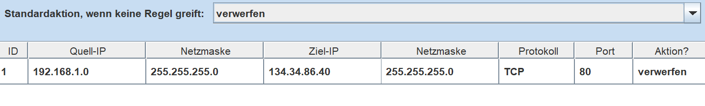
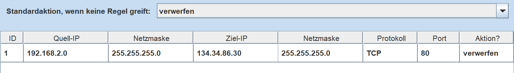
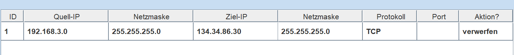

# 07 – Zugriffskontrolle auf den Webserver (Firewallregel)

Obwohl das Routing zwischen allen Netzen korrekt funktioniert und sich alle Clients gegenseitig anpingen können, wurde der Zugriff auf den Webserver bewusst eingeschränkt.

Dies stellt ein zentrales Sicherheitskonzept dieses Projekts dar.

---

## 🔐 Ziel der Zugriffskontrolle

Nicht jedes Netz darf auf zentrale Serverdienste zugreifen.  
In realen Netzwerken werden Server nur für bestimmte Bereiche freigegeben.

In diesem Projekt wurde folgende Regel umgesetzt:

| Netz | Zugriff auf Webserver |
|------|------------------------|
| 192.168.1.0 | ❌ blockiert |
| 192.168.2.0 | ❌ blockiert |
| 192.168.3.0 | ❌ blockiert |
| 192.168.4.0 | ✅ erlaubt |

---

## ⚙️ Umsetzung der Regel

Diese Zugriffsbeschränkung wurde über eine Firewallregel auf dem Switch im Servernetz umgesetzt.

Der Switch filtert den Datenverkehr zum Webserver anhand der Quell-IP-Adresse.

Dadurch entsteht folgende Situation:

- Ping funktioniert zwischen allen Netzen (Routing korrekt)
- Webzugriff ist nur aus Netz 4 möglich

---

## 🧠 Bedeutung für das Netzwerkdesign

Diese Konfiguration zeigt, dass:

- Routing alleine nicht über Zugriffe entscheidet
- gezielte Sicherheitsregeln notwendig sind
- Netzwerke logisch getrennt und kontrolliert werden können

Das ist ein typisches Vorgehen in Unternehmensnetzwerken.

---

## 🧪 Beobachtetes Verhalten

| Test | Ergebnis |
|------|----------|
| Ping zwischen Netzen | funktioniert |
| DNS-Auflösung | funktioniert |
| Webzugriff aus Netz 1–3 | blockiert |
| Webzugriff aus Netz 4 | erlaubt |

---

## 📸 Nachweis (Screenshot)

**Einfügen:**

